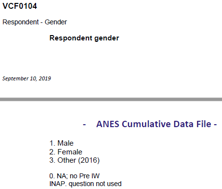
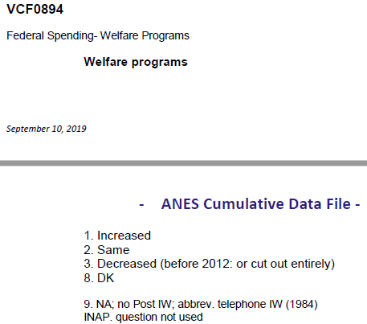
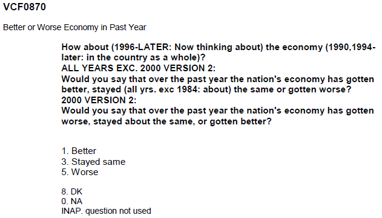
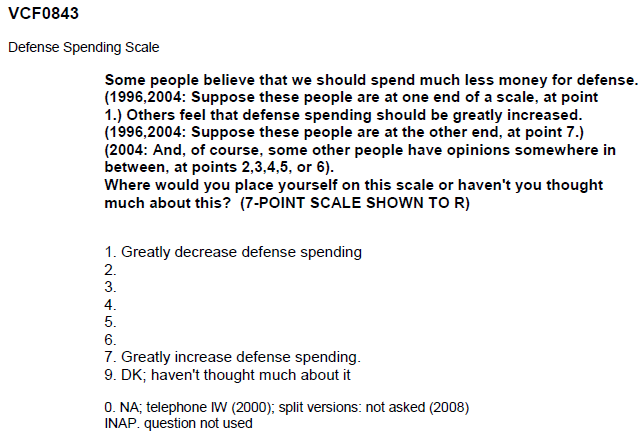

This is an [R Markdown](http://rmarkdown.rstudio.com) Notebook. 

# 1. Introduction
So many investigations have been focused on grand topics categorized by voters' wealth, education, race, Republicans/Democrats. However, what about a small angle, gender, to see special altitudes from male and female towards a particular question, what is the most important national problem. This question reflects their most concerns and affects their choice and decisions on other topics related to the presidential election.

The data source is Time Series Cumulative Data from The American National Election Studies (ANES). Any year without valid data and data with NA are excluded in the analysis.

# 2. Data processing for this R Notebook

## 2.1 Checking `R` packages for data processing

The possible required packages are `tidyverse`, `haven`, `devtools`, `RColorBrewer`, `DT`, and `ggplot2`.

```{r load libraries, warning=FALSE, message=FALSE, include=FALSE}
packages.used=as.list(
  c(
  "tidyverse",
  "haven",
  "devtools",
  "RColorBrewer",
  "data.table",
  "ggplot2")
)

check.pkg = function(x){
  if(!require(x, character.only=T)) install.packages(x, 
                                                     character.only=T,
                                                     dependence=T)
}

lapply(packages.used, check.pkg)
```

## 2.2 Import raw ANES data

We will be working with the SAV format of the raw ANES data, downloaded from [this page](https://electionstudies.org/data-center/anes-time-series-cumulative-data-file/), once you are registered *and* logged in. This is a saved data file from SPSS. We will use the `read_sav` function from the `haven` package. 

Read more about [importing SPSS data into R](https://www.marsja.se/how-to-read-write-spss-files-in-the-r-statistical-environment/).

```{r read in data, message = F}
library(haven)
anes_dat <-
    read_sav("../data/anes_timeseries_cdf.sav")
```

Some basic data summaries: there are `r nrow(anes_dat)` respondents and `r ncol(anes_dat)` variables.

```{r year barplot}
barplot(table(anes_dat$VCF0004),
        las=2,
        main="number of respondents over the years")
```

## 2.3 Process variables for analysis
In the following, I will create a few variables. These variables were selected based on their description in the ANES codebook.

+ VCF0875: What is the most important national problem
+ VCF0104: Respondent gender
+ VCF0894: Welfare programs
+ VCF0870: Better or worse economy in past year
+ VCF0843: Defense spending scale







First let's look at our data. One advantage of using the SPSS SAV data is that the values are *labelled*. By converting labelled data to factor, you can easily reveal the responses encoded by numbers. We selected four variables for subsequent analysis and save the filtered data sets to the `output` folder.

The election years are restricted up to 2000 since there are no no further records for "What is the Most Important National Problem". Only data in electron years are considered. The data are prepared to save as `output/data_use.RData`.

```{r labelled variables subset}
Election_years=as.character(seq(1948, 2000, 4))

anes_use=anes_dat%>%
  mutate(
    year=as_factor(VCF0004),
    most_important_national_problem=as_factor(VCF0875),
    gender=as_factor(VCF0104),
    welfare_programs=as_factor(VCF0894),
    economy_past_year=as_factor(VCF0870),
    defense_spending_scale=as_factor(VCF0843)
  )%>%
  filter(year %in% Election_years)

library(data.table)

data.table(anes_use%>%
             select(year, most_important_national_problem, gender, welfare_programs, economy_past_year, defense_spending_scale)%>%
             filter(!is.na(most_important_national_problem))%>%
             sample_n(30))

anes_use = anes_use%>%select(year, most_important_national_problem, gender, welfare_programs, economy_past_year, defense_spending_scale)

save(anes_use, file="../output/data_use.RData")
```

# 3. Analysis

## 3.1 For different genders, What is the most important national problem?

First, we would like to see whether different gender groups have different thinking of the most important national problem. This answer will lead the whole following analysis.


```{r}
load(file="../output/data_use.RData")
anes_to_most_important_national_problem_year = anes_use %>%
  filter(!is.na(gender) & !is.na(most_important_national_problem))%>%
  group_by(year, gender)%>%
  count(most_important_national_problem)%>%
  group_by(year, gender)%>%
  mutate(
    prop=n/sum(n)
  )

ggplot(anes_to_most_important_national_problem_year, 
       aes(x=year, y=prop, fill=most_important_national_problem)) +
  geom_bar(stat="identity", colour="black") + facet_wrap(~gender, ncol=1) + theme_bw()+
  theme(axis.text.x = element_text(angle = 90))+
  scale_fill_brewer(palette="Set3")+
  labs(title="How did different gender groups think What was the most important national problem \n over the years?")
```
There are three most significant variance, agriculture, economics, and foreign affairs/national defense.

Economics problem of male's option increases from less than 10% in 1960 to 50%, as the peak in 1980 becoming a major issue of the US society, then maintain a stable value ~50% and decreases to ~20% in 2000. Female's option also has a similar trend in these years. U.S. economy experienced a deep recession in the 1980s due to disinflationary monetary policy, and increased oil price rafter Iranian Revolution.([Ref](https://bancroft.berkeley.edu/ROHO/projects/debt/1980srecession.html)) It could be the main reason to observe the peak point.

However, foreign affairs/national defense (simplified as defense) problem of male's option decreases from ~60% in 1960 to 5%, but increases to 30% and maintaining the value from 1980 to 1984 before decreasing after 1984. Female's option also has a similar trend. It is aligned with Reagan's foreign policy "peace through strength" and increased defense spending of 35%.([Ref](https://www.whitehouse.gov/about-the-white-house/presidents/ronald-reagan/)).

Even welfare program has a trend to be more and more important approaching 2000. However, it has not dominated until 1992. Female's option also has a similar trend. This point aligns with Bill Clinton's Welfare Reform in the 1990s.([Ref](https://www.history.com/news/clinton-1990s-welfare-reform-facts))

```{r}
ggplot(anes_to_most_important_national_problem_year, 
       aes(x=year, y=prop, group=gender,color=gender)) + 
  geom_line() + geom_point() + 
  facet_wrap(~most_important_national_problem) + theme_bw()+ 
  theme(axis.text.x = element_text(angle = 90))+ 
  labs(title="How did different gender groups think what was the most important national problem \n over the years, showing by trend?")
```
Let's zoom in economics and social welfare. ~10% more male thinks the most important national problem is economics compared with female. On the contrary, ~10% more female thinks spacial welfare is the most important problem. Both male and female keep the same proportion for the remaining options.

Next, explore male and female' options on these three problems in ANES data for further investigation.

## 3.2 For different genders, what is the attitude towards federal spending on welfare programs?


```{r}
load(file="../output/data_use.RData")
anes_to_welfare_programs_year = anes_use %>%
  filter(!is.na(gender) & !is.na(welfare_programs))%>%
  group_by(year, gender)%>%
  count(welfare_programs)%>%
  group_by(year, gender)%>%
  mutate(
    prop=n/sum(n)
  )

ggplot(anes_to_welfare_programs_year, 
       aes(x=year, y=prop, fill=welfare_programs)) +
  geom_bar(stat="identity", colour="black") + facet_wrap(~gender, ncol=1) + theme_bw()+
  theme(axis.text.x = element_text(angle = 90))+
  scale_fill_brewer(palette="Blues")+
  labs(title="What is the different gender groups' attitudes towards federal spending on welfare programs?")
```
```{r}
ggplot(anes_to_welfare_programs_year, 
       aes(x=year, y=prop, group=gender,color=gender)) + 
  geom_line() + geom_point() + 
  facet_wrap(~welfare_programs) + theme_bw()+ 
  theme(axis.text.x = element_text(angle = 90))+ 
  labs(title="What is the different gender groups' attitudes towards federal spending on welfare programs \n over the years, showing by trend?")
```
There are three year's data for welfare programs, as shown in the above two figures. I do not discuss much on the trend since the insufficient data points. However, it is clear that both male and female prefer decreased federal spending on welfare, at least no increasing, during 1992 and 2000. the male has ~10% more proportion compared with female to have the option of decrease welfare spending.

## 3.3 For different genders, what is the attitude towards economy performance in past year?


```{r}
load(file="../output/data_use.RData")
anes_to_economy_past_year = anes_use %>%
  filter(!is.na(gender) & !is.na(economy_past_year))%>%
  group_by(year, gender)%>%
  count(economy_past_year)%>%
  group_by(year, gender)%>%
  mutate(
    prop=n/sum(n)
  )

ggplot(anes_to_economy_past_year, 
       aes(x=year, y=prop, fill=economy_past_year)) +
  geom_bar(stat="identity", colour="black") + facet_wrap(~gender, ncol=1) + theme_bw()+
  theme(axis.text.x = element_text(angle = 90))+
  scale_fill_brewer(palette="Blues")+
  labs(title="What is the different gender groups' attitudes towards economy performance in past year?")
```

```{r}
ggplot(anes_to_economy_past_year, 
       aes(x=year, y=prop, group=gender,color=gender)) + 
  geom_line() + geom_point() + 
  facet_wrap(~economy_past_year) + theme_bw()+ 
  theme(axis.text.x = element_text(angle = 90))+ 
  labs(title="What is the different gender groups' attitudes towards economy performance in past year \n over the years, showing by trend?")
```
If "Better" and "Stayed same" are considered as "not worse", "not worse" and "worse" have the opposite trend clearly shown in the figure above. It can also be observed difference that male is more optimistic with the past economy while female is more pessimistic. The difference is 10% for both. "Worse" can represent the trend of people's altitude as the extreme points at 1984 and 1992, which aligns the extreme economics points for the figure of the most important national problem.

## 3.4 For different genders, what is the attitude towards defense spending scale?


```{r}
load(file="../output/data_use.RData")
anes_to_defense_spending_scale_year = anes_use %>%
  filter(!is.na(gender) & !is.na(defense_spending_scale))%>%
  group_by(year, gender)%>%
  count(defense_spending_scale)%>%
  group_by(year, gender)%>%
  mutate(
    prop=n/sum(n)
  )

ggplot(anes_to_defense_spending_scale_year, 
       aes(x=year, y=prop, fill=defense_spending_scale)) +
  geom_bar(stat="identity", colour="black") + facet_wrap(~gender, ncol=1) + theme_bw()+
  theme(axis.text.x = element_text(angle = 90))+
  scale_fill_manual(values = c("#ffffff", "#3ACBE8", "#1CA3DE", "#0D85D8", "#F6DA62", "#F4B757", "#F3734C", "#000000"))+
  labs(title="What is the different gender groups' attitudes towards defense spending scale?")
```
The 1-4 are grouped as "general decrease" while 5-7 are grouped as "general increase". This division is more representative than the original subdivision. I focus on the blue-yellow boundary prop value to observe the domination. Male's option shows the altitude of decreasing defense spending scale from 1980 to 75% in 1992. Then a decreased altitude to ~60% in 2000. Female has a similar trend. This extreme value point could be due to the US advantages in Cold War and winning of Cold War at 1992. ([Ref](https://www.mercatus.org/publications/government-spending/us-federal-budget-restraint-1990s-success-story)).

```{r}
ggplot(anes_to_defense_spending_scale_year, 
       aes(x=year, y=prop, group=gender,color=gender)) + 
  geom_line() + geom_point() + 
  facet_wrap(~defense_spending_scale) + theme_bw()+ 
  theme(axis.text.x = element_text(angle = 90))+ 
  labs(title="What is the different gender groups' attitudes towards defense spending scale \n over the years, showing by trend?")
```
Focus on 1.Greatly decrease defense spending and 7.Greatly increase defense spending. Female is more than ~10% compared with male to decrease defense spending scale. However, the male is more than ~10% compared with male to increase defense spending scale. Female tends to be more conservative in defense compared with the male in extreme conditions options such as two "Greatly" here.

# 4. Conclusion
The investigation focuses on gender differences of altitudes towards the question, what is the most important national problem. The significant patterns of economics, foreign affairs/national defense, and welfare program are explained both in data and politics. These three variables are zoomed in to do a further detailed investigation. Generally speaking, male and female has no much difference for the given variables. However, male cares more about economics while female cares more about welfare.
